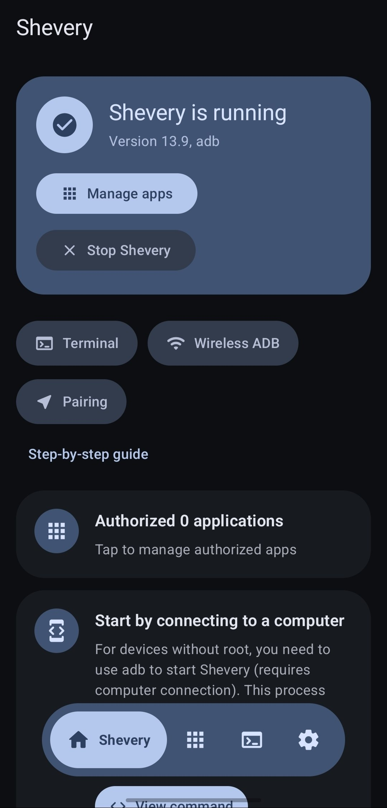
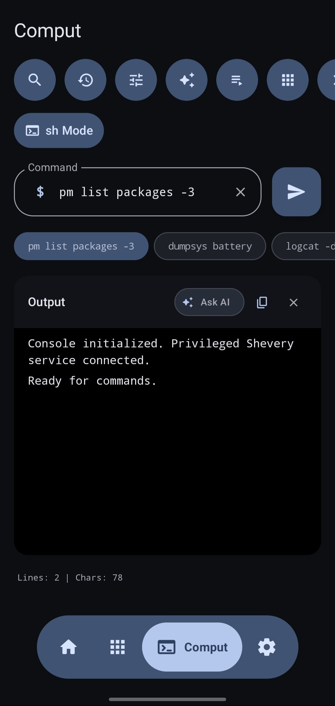
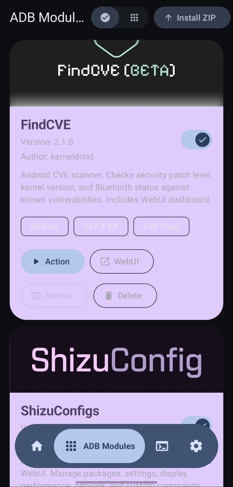
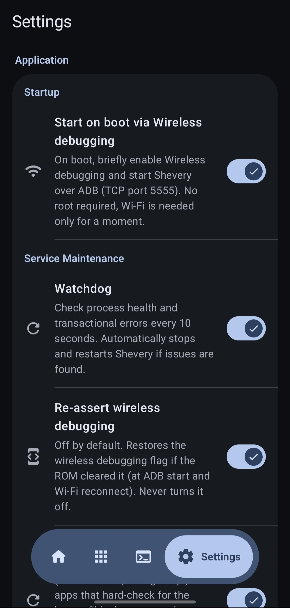

# Shevery

[English](README.md) | [简体中文](README.zh-CN.md) | [日本語](README.ja.md)

## 分支状态

> [!IMPORTANT]
> **需要执行迁移操作：** 由于应用标识从 moe.shizuku.privileged.api 更改为 **com.hamondev.shevery**，在安装 Shevery 之前，你**必须卸载**设备上任何旧版官方 Shizuku Manager 应用。否则，两者会发生冲突。
上游项目参考：<https://github.com/RikkaApps/Shizuku>
>

## 分支新增功能

- 使用 Material 3 Expressive 组件、动效、开关和圆角图标设计的 Jetpack Compose 管理器界面。
- **Dhizuku 实验性支持**：在实验室功能中提供专用的设备所有者桥接系统。
- 改进了基于 shell/adb 的 “Comput” 功能，支持 Gemini 解释、宏和 Commandium AI 命令创建。
- 此分支采用当前 SDK/构建工具，开展 Android 16/17 目标版本适配工作。
- 用于安装和管理 ZIP 模块的 ADB Modules 界面。
- 模块功能：`module.prop`、横幅、启用/禁用开关、`action.sh`、受策略控制的 `service.sh`、本地 WebUI、删除、路径检查、大小限制、输出限制和最近运行日志。
- 模块策略设置：安全模式、完全访问权限和后台操作控制。
- 支持直接安装的模块目录。

## 文档

- [ADB Modules 指南](docs/adb-modules-guide.md)
- [ADB Modules API 参考](docs/adb-modules-api.md)
- [Shizuku Connectors API](docs/shizuku-connectors.md)
- [Android 17 兼容性](docs/android-17-compatibility.md)
- [ADB Modules 发布指南](docs/github-catalog.md)

## 背景

开发需要 root 权限的应用时，最常见的方法是在 su shell 中运行一些命令。例如，某个应用会使用 `pm enable/disable` 命令启用或禁用组件。

这种方法存在很大的缺点：

1. **极其缓慢**（需要创建多个进程）
2. 需要处理文本（**非常不可靠**）
3. 能力受限于可用命令
4. 即使 ADB 拥有足够的权限，应用也需要 root 权限才能运行

Shizuku 采用了完全不同的方式。请参阅下方的详细说明。

## 用户指南与下载

<https://shizuku.rikka.app/>

## 截图

  
📸 点击打开截图画廊

   
  <table>
    <tr>
      <td align="center"> <b>主界面</b></td>
      <td align="center"> <b>Comput 控制台</b></td>
    </tr>
    <tr>
      <td align="center"> <b>ADB Modules</b></td>
      <td align="center"> <b>设置</b></td>
    </tr>
  </table>

## Shevery 如何工作？

首先，我们需要了解应用如何使用系统 API。例如，如果应用需要获取已安装的应用，我们都知道应该使用 `PackageManager#getInstalledPackages()`。这实际上是应用进程和系统服务器进程之间的进程间通信（IPC）过程，只不过 Android 框架替我们完成了内部工作。

Android 使用 `binder` 执行这种 IPC。`Binder` 允许服务端获知客户端的 uid 和 pid，使系统服务器能够检查应用是否有权执行相应操作。

通常，如果应用可以使用某个“管理器”（例如 `PackageManager`），系统服务器进程中就应该有一个对应的“服务”（例如 `PackageManagerService`）。我们可以简单地理解为：如果应用持有该“服务”的 `binder`，就能与“服务”通信。应用进程启动时会收到各项系统服务的 binder。

Shizuku 会引导用户先通过 root 或 ADB 运行一个进程，即 Shizuku 服务端。应用启动时，Shizuku 服务端的 `binder` 也会被发送给应用。

Shevery 提供的最重要功能类似于充当中间人：接收应用的请求，将请求发送给系统服务器，再把结果返回。详情可参阅 `rikka.shizuku.server.ShizukuService` 类中的 `transactRemote` 方法，以及 `moe.shizuku.api.ShizukuBinderWrapper` 类。

这样，我们就实现了以更高权限使用系统 API 的目标。对于应用而言，这与直接使用系统 API 几乎完全相同。

## 开发者指南

### API 与示例

https://github.com/RikkaApps/Shizuku-API

### 从 v11 之前的版本迁移

> 当然，现有应用仍然可以正常工作。

https://github.com/RikkaApps/Shizuku-API#migration-guide-for-existing-applications-use-shizuku-pre-v11

### 注意事项

1. ADB 权限有限

   ADB 的权限有限，并且会因系统版本而异。你可以在[这里](https://github.com/aosp-mirror/platform_frameworks_base/blob/master/packages/Shell/AndroidManifest.xml)查看授予 ADB 的权限。

   调用 API 之前，可以使用 `ShizukuService#getUid` 检查 Shizuku 是否以 ADB 用户身份运行，或使用 `ShizukuService#checkPermission` 检查服务端是否拥有足够的权限。

2. Android 9 开始存在隐藏 API 限制

   从 Android 9 开始，普通应用对隐藏 API 的使用受到限制。请使用其他方法（例如 <https://github.com/LSPosed/AndroidHiddenApiBypass>）。

3. Android 8.0 与 ADB

   目前，Shizuku 服务将 `IActivityManager#registerProcessObserver` 与 `IActivityManager#registerUidObserver`（26+）结合使用来获取应用进程，以确保应用启动时可以发送该进程。然而在 API 26 上，ADB 无权使用 `registerUidObserver`。因此，如果需要在可能并非由 Activity 启动的进程中使用 Shizuku，建议通过启动一个透明 Activity 来触发 binder 发送。

4. 直接使用 `transactRemote` 时需要注意

   * 不同 Android 版本中的 API 可能有所不同，请务必仔细检查。另外，`android.app.IActivityManager` 在 API 26 及更高版本中采用 aidl 形式，而 `android.app.IActivityManager$Stub` 仅存在于 API 26。

   * `SystemServiceHelper.getTransactionCode` 可能无法获取正确的事务代码。例如，在 API 25 上不存在 `android.content.pm.IPackageManager$Stub.TRANSACTION_getInstalledPackages`，而是存在 `android.content.pm.IPackageManager$Stub.TRANSACTION_getInstalledPackages_47`（这种情况已经得到处理，但不排除还存在其他情况）。使用 `ShizukuBinderWrapper` 方法时不会遇到这个问题。

## 开发 Shizuku 本身

### 构建

- 使用 `git clone --recurse-submodules` 克隆
- 运行 Gradle 任务 `:manager:assembleDebug` 或 `:manager:assembleRelease`

`:manager:assembleDebug` 任务会生成可调试的服务端。你可以将调试器附加到 `shizuku_server` 以调试服务端。请注意，在 Android Studio 中应勾选 “Run/Debug configurations” - “Always install with package manager”，以便服务端使用最新代码。

## 许可证

本项目的所有代码文件均采用 Apache 2.0 许可证。

特别说明 Apache 2.0 第 6 节：

* **禁止**使用 `manager/src/main/res/mipmap*/ic_launcher*.png` 图像文件，除非用于展示 Shizuku 本身。

* **禁止**将 `Shevery` 用作应用名称、将 `moe.shizuku.privileged.api` 或 `com.hamondev.shevery` 用作应用 ID，或声明 `moe.shizuku.manager.permission.*` 权限。

## 致谢

* [Nightzuku](https://github.com/kerneldroid/Nightzuku) - 提供了部分应用界面、模块目录系统和 Android 17 支持。
* [Shizuku](https://github.com/rikkaapps/Shizuku) - 提供了 Shizuku API 和主要源代码。

### 不建议在第三方文件管理器和网站上安装 Shevery，最好去 GitHub 下载。
